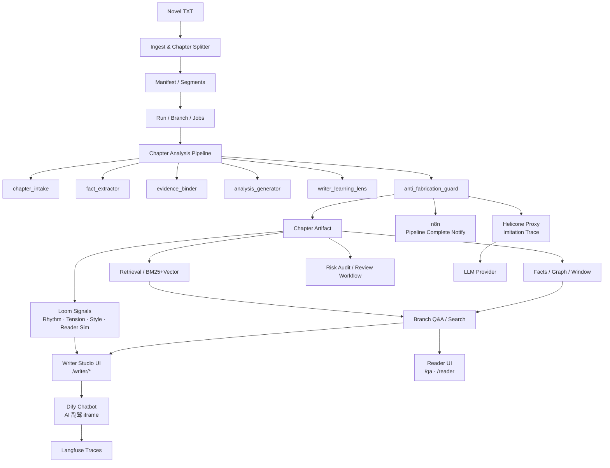

# novel-analyzer · AI 小说助手平台

> v0.2.4 — 面向作家与读者的 AI 小说理解、创作辅助与阅读增强系统。

---

## 产品定位

这不是通用 AI 写作器，而是面向长篇小说的**内容理解 + 风险门控 + 受控生成**平台，服务两类用户：

| 用户 | 核心价值 |
|------|---------|
| **作家 / 工作室** | 仿写辅助、Loom 信号实时反馈、风险门控、连续性审查 |
| **读者** | 章节 Q&A、引用跳转、人物事件检索、防剧透摘要 |

---

## 核心能力

### 拆书与检索
- 章节切分 + 规范化
- BM25 / trigram / vector 混合检索（PostgreSQL 原生）
- 推理图谱（人物 / 事件 / 因果 / 伏笔）
- 窗口摘要 / 状态机
- **P0 锁定基线**：simple R@5 = 0.81，jieba R@5 = 0.84，5 本书 587 docs 验证（domain dict + pg_jieba + bm25_vector 三件套已固化）

### 风险门控
- 语义风险信号（OOC / 规则漂移 / 时间线 / 战力）
- 集群审查工作流（review cluster / batch execute）
- 风险证据包导出
- 9 个 checker 进入 mainline，preflight + harness routing 已就绪

### 受控仿写
- **章节级仿写**（`imitate-chapter` / `iterate-imitation` / `review-imitation`）— 全部支持 `--world-map / --character-map / --power-map / --rule-override` 等映射 flag
- **整本仿写编排**（`writer-imitate-range`）— per-chapter 增量保存、auto-retry（thin / scaffold / action-queue 三类 contamination 实时拦截）
- **跨题材改写（mapping_pack）— 已突破**：3 套目标题材验证，**170/171 章 verdict=pass（99.4%）**，mapping accuracy 96-98%（卫图→科幻 102/102，诛仙→科幻 58/59，卫图→都市修真 10/10）
- 同题材 baseline self-check 已加入 prompt，待长跑验证（[handoff](./docs/handoffs/baseline-imitation-quality-validation-handoff-20260515.md)）
- Loom 信号：节奏 / 张力 / 风格对照 / 读者模拟（4 视角）
- 修复通道 + 长篇连续性诊断

### 读者 Q&A
- 流式问答（RAG + 图谱推理）
- 引用章节可跳转
- 人物 / 事件检索
- 证据摘要 + 推理路径渲染

---

## 商用就绪状态（2026-05-15）

| 能力 | 状态 | 实证 |
|---|---|---|
| **跨题材改写**（B2B API） | ✅ 技术 ready | 170/171 pass / 1M+ 字 / 3 题材 |
| 章节 Q&A + 引用跳转 | ✅ 可用 | R@5 0.81+ 跨 5 本书 |
| 风险审查工作流 | ✅ 可用 | 9 checker mainline |
| 仿写辅助（作家工作台） | ⚠️ 辅助级 | harness + Loom 信号成熟，不能宣称 "AI 自动写书" |
| 同题材整本仿写 | 🔧 验证中 | 0/307 → 已修复 prompt，待 Stage A/B/C 长跑 |
| 多租户 SaaS | ❌ 未就绪 | 6 项 infra gap（计费/限流/fallback/隔离/版权/监控） |

详细决策表：[`docs/cross-genre-imitation-commercial-readiness-20260515.md`](./docs/cross-genre-imitation-commercial-readiness-20260515.md)
能力全景：[`docs/chapter-imitation-capability-matrix.md`](./docs/chapter-imitation-capability-matrix.md)

---

## 技术栈

| 层 | 技术 |
|----|------|
| 后端 | Python 3.11 · FastAPI · LangGraph · SQLAlchemy |
| 数据库 | PostgreSQL（pg_trgm / pgvector / pg_jieba） |
| 前端 | Next.js 15 · React 18 · Ant Design 5 |
| AI 编排 | Dify（Chatbot / Workflow / Prompt Studio） |
| 外围自动化 | n8n（通知 / 日报 / 第三方集成） |
| 可观测性 | Langfuse（Dify 内置集成）· Helicone（LLM proxy trace） |
| Embedding | ONNX（本地）/ HTTP（TEI / OpenAI / Jina） |

---

## 用户界面入口

### 作家端 — Writer Studio
```
http://127.0.0.1:4173/writer/<branch_id>
```
- 编辑器画布（autosave）
- Loom 信号侧栏（节奏 / 张力 / 风格 / 伏笔密度）
- AI 副驾（Dify Chatbot iframe，流式 + 引用）
- 版本树（仿写分支管理）

### 读者端 — Reader Studio
```
http://127.0.0.1:4173/reader/<branch_id>
```
- 三栏布局：左侧章节导航 / 中央阅读 / 右侧 Q&A
- 章节导航：摘要预览 + 吸引度评分 + 风险标签 + 搜索过滤
- 防剧透 Q&A：默认只用 ≤ 当前章节的数据回答，可关闭
- 读者体验评分：4视角（普通读者 / 资深读者 / 情感满足 / 编辑视角）
- 读者反馈：1-5 星评分 + 评论，汇总展示

### 旧工作台（Workbench）
```
http://127.0.0.1:4173
```
| 页面 | 功能 |
|------|------|
| `/control` | 导入 + 启动 + 恢复 |
| `/reader` | 章节阅读 + 原文回看 |
| `/qa` | 整本问答 / 人物事件检索（流式 + 引用跳转） |
| `/pipeline` | Pipeline 编排与进度 |
| `/quality` | 质量仪表盘 |
| `/ops` | 导出 + 恢复 |

---

## 文档入口

> **三秒答疑**：[`docs/OVERVIEW.md`](./docs/OVERVIEW.md) · [`docs/ROADMAP.md`](./docs/ROADMAP.md) · [`docs/GLOSSARY.md`](./docs/GLOSSARY.md)

### 按角色 / 培训路径

| 我是… | 入口 |
|-------|------|
| 🆕 第一次接触 | [`docs/OVERVIEW.md`](./docs/OVERVIEW.md) — 一页读懂系统 |
| 👨‍💻 开发 / 工程师 | [`docs/training/developer.md`](./docs/training/developer.md) — Day 1-3 上手 |
| ✍️ 使用者 / 作家 | [`docs/training/user.md`](./docs/training/user.md) — 半天上手 |
| 🛠️ 运维 / 实施 | [`docs/training/operator.md`](./docs/training/operator.md) — 部署 + 故障决策树 |
| 💼 业务 / 产品 / 销售 | [`docs/training/business.md`](./docs/training/business.md) — 60 分钟客户讲解 |

### 按能力线（4 条核心能力）

| 能力线 | 状态 | 入口 |
|--------|------|------|
| **拆书引擎** | ✅ Phase 4.5；R@5 = 0.81/0.84 | [`docs/capabilities/01-deconstruction.md`](./docs/capabilities/01-deconstruction.md) |
| **风险检查** | ✅ 9 checker mainline | [`docs/capabilities/02-risk-audit.md`](./docs/capabilities/02-risk-audit.md) |
| **受控仿写** | ✅ 跨题材 99.4%；🔧 同题材验证中 | [`docs/capabilities/03-imitation.md`](./docs/capabilities/03-imitation.md) |
| **商业化运营** | ⚠️ 4 周可商用 B2B；6 项 SLA gap | [`docs/capabilities/04-commercialization.md`](./docs/capabilities/04-commercialization.md) |

> 快速理解仿写这条能力线到底如何工作、用了什么技术、解决了什么问题：[`docs/imitation-architecture-map-20260518.md`](./docs/imitation-architecture-map-20260518.md)

### 高频常用

| 文档 | 用途 |
|------|------|
| [`docs/imitation-architecture-map-20260518.md`](./docs/imitation-architecture-map-20260518.md) | **仿写能力大架构图**（一眼看懂链路、能力与技术核心） |
| [`docs/cli-operations-manual.md`](./docs/cli-operations-manual.md) | CLI 命令真相源 |
| [`docs/api-current-surface.md`](./docs/api-current-surface.md) | 当前 API 端点清单 |
| [`docs/ops-debug-manual-20260514.md`](./docs/ops-debug-manual-20260514.md) | 故障速查（5 棵决策树） |
| [`docs/runbook/deployment-and-operations-manual-20260515.md`](./docs/runbook/deployment-and-operations-manual-20260515.md) | 从零部署 + 日常运维总章 |
| [`docs/runbook/business-loop.md`](./docs/runbook/business-loop.md) | v3 端到端 6 步 smoke |
| [`docs/handoffs/`](./docs/handoffs/README.md) | 会话交接（接手人优先看最近一棒） |
| [`docs/cross-genre-imitation-commercial-readiness-20260515.md`](./docs/cross-genre-imitation-commercial-readiness-20260515.md) | 跨题材商用决策表 |

完整文档中心：[`docs/README.md`](./docs/README.md)

---

## 快速启动

我们支持两种部署模式，按需选择：

| 场景 | 数据库 | LLM | Embedding / Rerank | 入口 |
|------|--------|-----|---------------------|------|
| **A. 全外部依赖**（推荐） | 外部 PostgreSQL | 外部 API（DeepSeek 等） | 外部 TEI HTTP 服务 | [→ 路径 A](#路径-a全外部依赖) |
| **B. 本地一体化** | 本地 PostgreSQL | 外部 API | 本地 ONNX 模型 | [→ 路径 B](#路径-b本地一体化) |

> 改完任何环境变量后，跑 `make smoke-external` 一键探针 4 个外部端点。

---

### 路径 A：全外部依赖

数据库 / TEI Embedding / TEI Rerank 都在外部主机，本机只跑 Python 后端 + Next.js 前端。

#### 1. 安装依赖
```bash
python3 -m venv .venv
.venv/bin/pip install -r requirements.txt
```

#### 2. 配置后端环境变量
```bash
cp .env.local.template .env.local
$EDITOR .env.local
```

填这几项（无鉴权 TEI 时 `EMBEDDING_API_KEY` / `RERANK_API_KEY` 留空）：
- `NOVEL_ANALYZER_DB_HOST` / `DB_USER` / `DB_PASSWORD` / `DB_NAME`
- `NOVEL_ANALYZER_LLM_BASE_URL` / `LLM_API_KEY` / `LLM_MODEL_NAME`
- `NOVEL_ANALYZER_EMBEDDING_API_BASE`（外部 TEI embed 地址）
- `NOVEL_ANALYZER_RERANK_API_BASE`（外部 TEI rerank 地址）

#### 3. 探测外部依赖
```bash
make smoke-external
```

预期 4 个 ✓：DB 连通 + 扩展、LLM `/models`、TEI embed、TEI rerank。
失败时脚本会打印具体修复提示。

#### 4. 初始化数据库 schema
```bash
.venv/bin/alembic upgrade head
# 库还没建：先 .venv/bin/python -m novel_analyzer.cli.app init-db
```

PostgreSQL 必须开启扩展（一次性）：
```sql
CREATE EXTENSION IF NOT EXISTS pg_trgm;
CREATE EXTENSION IF NOT EXISTS vector;
CREATE EXTENSION IF NOT EXISTS pg_jieba;   -- 可选，中文检索 R@5 +0.03
```

#### 5. 配置前端环境变量
```bash
cp apps/web/.env.local.template apps/web/.env.local
$EDITOR apps/web/.env.local
```

至少把 `NEXT_PUBLIC_API_BASE` 改成后端实际地址（默认 `http://127.0.0.1:8011`）。

#### 6. 启动后端 + 前端
```bash
make api-dev                       # 后端 :8011 (uvicorn + FastAPI)

# 另开一个终端
cd apps/web
npm install
npm run dev                        # 前端 :4173
```

打开 `http://127.0.0.1:4173/control`，导入第一本小说。

---

### 路径 B：本地一体化

适合在单机上完整跑，包括本地 ONNX embedding。

```bash
# 1. 装依赖
python3 -m venv .venv
.venv/bin/pip install -r requirements.txt

# 2. 配 .env.local（用 .env.example 作为模板）
cp .env.example .env.local
$EDITOR .env.local                 # 填 DB / LLM，保留 EMBEDDING_BACKEND=onnx

# 3. 初始化数据库
.venv/bin/python -m novel_analyzer.cli.app init-db
.venv/bin/alembic upgrade head

# 4. 启动
make api-dev                       # 后端 :8011
cd apps/web && npm install && npm run dev   # 前端 :4173
```

---

### 导入小说并开始分析
```bash
# CLI 一键导入
.venv/bin/python -m novel_analyzer.cli.app auto-run /path/to/novel.txt --max-chapters 0

# 或通过 Workbench UI
open http://127.0.0.1:4173/control
```

### 仿写示例（5-章 spike）
```bash
# 同题材
.venv/bin/python -m novel_analyzer.cli.app writer-imitate-range \
  <branch_id> "2:目标A" "3:目标B" "4:目标C" "5:目标D" "6:目标E" \
  --output-dir output/spike --use-llm --max-rounds 2

# 跨题材改写（mapping_pack，已验证 99.4% pass）
.venv/bin/python -m novel_analyzer.cli.app writer-imitate-range \
  <branch_id> "2:目标A" "3:目标B" \
  --output-dir output/scifi --use-llm --max-rounds 2 \
  --world-map "郑国=星际联邦" --character-map "卫图=魏拓" \
  --power-map "养生功=星能调息术" \
  --rule-override "封建奴籍替换为合同义务工"
```

详见 [`docs/loom/roadmap.md`](./docs/loom/roadmap.md)

---

## 环境变量

完整配置模板见两个文件，按场景挑一个 `cp` 后改：

| 模板 | 场景 | 目标位置 |
|------|------|----------|
| [`.env.local.template`](./.env.local.template) | 全外部依赖（DB + TEI + LLM 都在外部） | `.env.local` |
| [`.env.example`](./.env.example) | 本地 ONNX + 外部 LLM | `.env.local` |
| [`apps/web/.env.local.template`](./apps/web/.env.local.template) | 前端构建期变量 | `apps/web/.env.local` |

加载顺序（后者覆盖前者）：真实环境变量 > `.env.local` > `.env`。
所有变量必须以 `NOVEL_ANALYZER_` 前缀（前端用 `NEXT_PUBLIC_`、n8n 用 `N8N_`）。

### 关键变量速查

```bash
# 数据库
NOVEL_ANALYZER_DB_HOST=...
NOVEL_ANALYZER_DB_USER=...
NOVEL_ANALYZER_DB_PASSWORD=...
NOVEL_ANALYZER_DB_NAME=novel_analyzer

# LLM
NOVEL_ANALYZER_LLM_BASE_URL=https://api.deepseek.com/v1
NOVEL_ANALYZER_LLM_API_KEY=sk-***
NOVEL_ANALYZER_LLM_MODEL_NAME=deepseek-chat

# Embedding（外部 TEI，无鉴权 → API_KEY 留空）
NOVEL_ANALYZER_EMBEDDING_BACKEND=http
NOVEL_ANALYZER_EMBEDDING_API_BASE=http://tei-host:8080
NOVEL_ANALYZER_EMBEDDING_API_FORMAT=tei

# Rerank（外部 TEI，无鉴权）
NOVEL_ANALYZER_RERANK_BACKEND=http
NOVEL_ANALYZER_RERANK_API_BASE=http://tei-host:8081
NOVEL_ANALYZER_RERANK_API_FORMAT=tei

# 前端（apps/web/.env.local）
NEXT_PUBLIC_API_BASE=http://api-host:8011
```

### 可选：v3 外围集成
```bash
# n8n pipeline 完成 webhook（不设则静默）
# N8N_WEBHOOK_PIPELINE_COMPLETE_URL=http://localhost:5678/webhook/pipeline-complete

# Helicone 透明 LLM proxy（不设则直连）
# NOVEL_ANALYZER_LLM_BASE_URL_OVERRIDE=http://localhost:8585/v1/openai

# Dify Writer Copilot（前端 iframe）
# NEXT_PUBLIC_DIFY_BASE_URL=http://localhost:8080
# NEXT_PUBLIC_DIFY_WRITER_COPILOT_TOKEN=app-xxxxxxxxxx
```

---

## 排查 · `make smoke-external` 失败

| 失败项 | 常见原因 | 修复 |
|--------|----------|------|
| **Settings load** | `.env.local` 里 `EMBEDDING_BACKEND=http` 但 `EMBEDDING_API_BASE` 空 | 补上 `EMBEDDING_API_BASE`；或改回 `onnx` |
| **PostgreSQL** | host 不通 / 用户密码错 / 库不存在 | 用 `psql` 验证一遍连接串 |
| **PostgreSQL · missing extension** | DB 没装 `pg_trgm` / `vector` | `CREATE EXTENSION ...`（需 superuser） |
| **LLM /models 401** | `LLM_API_KEY` 不对或没传 | 重新生成 key 并填 `NOVEL_ANALYZER_LLM_API_KEY` |
| **LLM /models 404** | provider 不暴露 `/models`（少数自建网关） | 直接试 `make api-dev` 跑一次问答，若可用就忽略；smoke 脚本对自建网关不强制 |
| **Embedding HTTP 422** | TEI 实例的模型名 ≠ 配置的 `EMBEDDING_MODEL_NAME` | 改成 TEI 实际加载的模型名 |
| **Rerank 顺序错** | rerank 实例不是 bge-reranker-v2-m3 | 检查 TEI 启动命令的 `--model-id` |

---

## 自托管 Infra（可选）

所有 infra 组件均为独立 docker-compose，互不依赖，按需启动：

| 组件 | 端口 | 用途 | 启动 |
|------|------|------|------|
| **Dify** | 8080 | Chatbot / Prompt Studio / Workflow | `infra/dify/README.md` |
| **n8n** | 5678 | 通知 / 日报 / 第三方集成 | `cd infra/n8n && docker compose up -d` |
| **Langfuse** | 3030 | LLM trace（Dify 内置集成） | `infra/langfuse/README.md` |
| **Helicone** | 8585 | LLM proxy trace（imitation 主流量） | `infra/helicone/README.md` |

完整启动流程见 [`docs/runbook/v3-pickup-checklist.md`](./docs/runbook/v3-pickup-checklist.md)。

---

## 架构概览



---

## 开发命令

```bash
# 测试
.venv/bin/python -m pytest tests/ -q                  # 全量
.venv/bin/python -m pytest tests/test_imitation*.py   # 仿写相关
make v3-smoke                                          # e2e 烟雾测试

# 后端
make api-dev                                           # uvicorn FastAPI on :8011

# 前端
cd apps/web && npm run dev                             # Next.js on :4173
cd apps/web && npm run build                           # 生产构建

# Infra
make v2-up-all                                         # Dify + n8n + Langfuse
make v2-down-all                                       # 全部下线
make v2-status                                         # plan 进度
make v2-pickup-checklist                               # infra 启动步骤
make tei-up / tei-doctor                               # TEI embedding（可选）

# CLI（最常用）
.venv/bin/python -m novel_analyzer.cli.app --help
.venv/bin/python -m novel_analyzer.cli.app retrieval-benchmark <branch_id>
.venv/bin/python -m novel_analyzer.cli.app writer-imitate-range <branch_id> ...
```

详见 [`docs/cli-operations-manual.md`](./docs/cli-operations-manual.md) + [`docs/ops-debug-manual-20260514.md`](./docs/ops-debug-manual-20260514.md)

---

## 重要语义

- 章节是最小提交单元，当前章成功后才能继续下一章
- 回退采用**逻辑隐藏**，默认只读 active branch
- 手工结果允许保留，但默认 `participates_in_downstream = false`
- 拆书失败自动重试上限 **5 次**，超过后进入人工恢复流程
- 中文检索依赖 PostgreSQL 原生扩展（pg_trgm / pgvector / pg_jieba）

---

## 更多文档

- 变更记录：[`CHANGELOG.md`](./CHANGELOG.md)
- 完整文档中心：[`docs/README.md`](./docs/README.md)
- 当前 API surface：[`docs/api-current-surface.md`](./docs/api-current-surface.md)
- 商业化路线图：[`docs/strategy/writer-studio-roadmap.md`](./docs/strategy/writer-studio-roadmap.md)
