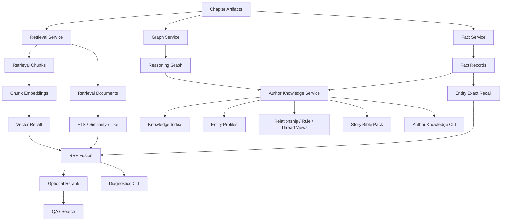

# Independent Agent Knowledge & Retrieval Architecture

## 1. 目标
这条能力线的目标不是绑定某个 agentOS，而是沉淀可抽离、可复用的底层能力：
- retrieval recall / rerank / diagnostics
- author-facing knowledge pack / control surface
- branch-level knowledge reuse for future independent agents or OpenClaw-style runtimes

## 2. 架构图



## 3. 当前能力
- retrieval 已具备：`fts` / `similarity` / `like` / `keyword` / `entity_exact` / `vector`
- diagnostics 已具备：raw/reranked/route/latency 可见性
- author knowledge 已具备：chapter cards、knowledge index、entity profiles、relationship/rule/thread 聚合、story bible pack，以及角色卡/动机树/成长弧/卷级弧线/未来章节骨架
- 真实样例已固化：
  - `docs/examples/sample-branch-search-diagnostics-20260505.sample.json`
  - `docs/examples/sample-branch-author-knowledge-20260505.sample.json`

## 4. 设计原则
1. retrieval 与 author knowledge 都是 **domain capability**，不是平台绑定能力。
2. 风险门控主判断仍独立，不直接被 QA retrieval rerank 接管。
3. author knowledge 是未来独立 agent / OpenClaw 抽离的优先候选层。

---

## 5. 可复用 RAG Core 抽离方向（新增）

当前最值得抽离的不是“整套小说 QA”，而是一个**默认不依赖 graph 的 reusable RAG core**。

### 5.1 推荐分层

```text
Reusable RAG Core
  ├─ Query Plan contract
  ├─ Hybrid Retrieval (FTS / similarity / like / keyword / entity-exact / vector)
  ├─ Evidence fusion (RRF)
  ├─ Optional rerank
  ├─ Diagnostics / eval hooks
  └─ Grounded answer orchestration contract

Optional Capability
  └─ Graph augmentation (route / path / signal / subgraph)

Domain Adapter
  ├─ Novel query taxonomy
  ├─ Chapter/window/spoiler semantics
  ├─ Foreshadow / causal / world-rule semantics
  └─ Novel-specific answer shaping
```

### 5.2 为什么 graph 不应是 core 默认项

- graph 构建和维护成本高
- 不同领域的 ontology 差异大
- 许多知识问答场景先用 lexical/fact/vector 就能起步
- 如果把 graph 当成必选，会抬高复用门槛并拖慢抽离进度

因此推荐：

> **先抽一个无 graph 也能工作的 core，再把 graph 作为 optional capability 接入。**

### 5.3 当前仓库里的候选分界线

#### 更接近 core 的部分
- `RetrievalService` 的多路召回、RRF、rerank、diagnostics
- `StructuredQueryPlan` / `RetrievalPreferences` / `QueryConstraints`
- retrieval materialization / chunk embedding pipeline

#### 更接近 domain adapter 的部分
- `BranchQAService` 里的窗口、伏笔、因果、世界规则上下文拼装
- `QUESTION_TYPE_KEYWORDS` 的小说问法与中文语义分类
- anti-spoiler `max_chapter` 语义
- `BranchQAResult` 当前的章节/图谱字段形态

#### 更接近 optional graph capability 的部分
- `GraphService`
- `EntityResolutionService`
- relationship / foreshadow / causal / world_rule 路由

### 5.4 推荐抽离顺序

1. 先抽 contract：`RetrievalHit` / `StructuredQueryPlan` / diagnostics schema
2. 再抽 hybrid retrieval + rerank + fusion
3. 再定义 `CorpusAdapter`
4. 然后定义 `GraphAdapter`，但保持 optional
5. 最后让 Novel QA 变成第一套 adapter

## 5. 待办
- retrieval live route benchmark
- story bible pack 已进入角色卡 / 动机树 / 成长弧 / 卷级规划 / 未来章节骨架，并开始被 next chapter planner 与 scene plan 消费
- whole-book / next-chapter 对 author knowledge 的更直接消费
