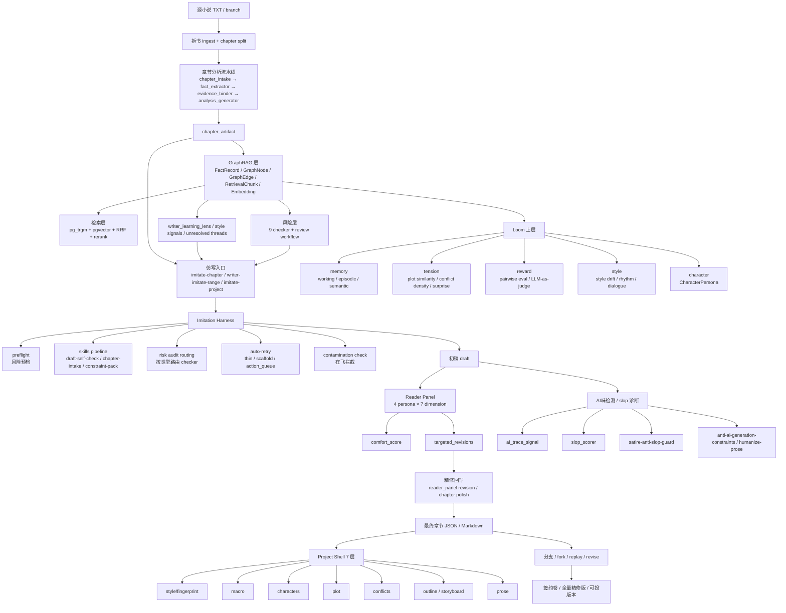

# 受控仿写能力大架构图（2026-05-18）

> **目标**：让第一次接手系统的人，光看这一份就能理解：
> 1) 我们在解决什么问题；
> 2) 仿写链路里有哪些核心能力；
> 3) 每一层用了什么技术；
> 4) 为什么这套方案比“直接喂 LLM 写小说”更强。

---

## 1. 一句话定位

这不是一个“让大模型裸写小说”的系统，而是一套**长篇仿写控制架构**：

- 用 **拆书 / GraphRAG / 风险检查** 先把原著理解透；
- 用 **harness + Loom + Reader Panel** 把生成过程卡住、测住、修住；
- 用 **项目壳 / 分支 / 精修链路** 把产物沉淀成可回退、可比较、可投签约的版本。

---

## 2. 这套架构在解决哪些核心问题

| 问题 | 直接喂 LLM 的结果 | 本系统的解法 |
|---|---|---|
| 长篇写到 20 章后人物开始跑偏 | 角色 OOC、关系断裂、动机失真 | 拆书事实层 + risk checker + Loom character/memory |
| 世界观设定会越写越乱 | 时间线、规则、战力、因果失控 | chapter_artifact + graph + 9 checker |
| 仿写像“套模板”，没有人味 | 节奏平、对话工具化、环境发白 | Reader Panel + 精修回写 + 反 AI 味约束 |
| 同题材整本仿写容易写塌 | scaffold、thin draft、空壳章节 | harness auto-retry + contamination check |
| 多轮实验结果散落、无法回退 | 不知道哪一版更好，难以合并 | Project Shell + branch/fork + version archive |
| 商业上需要签约卷，但无法稳定打样 | 开局强度不稳，编辑无法快速判断 | 30 章签约卷批量生成 + 分章 comfort 评估 + 精修流水线 |

---

## 3. 全流程大架构图



---

## 4. 分层解释：每一层做什么、用什么技术

### Layer A — 拆书理解层（先理解，再生成）

**目标**：让系统先理解原著，不盲写。

| 组件 | 作用 | 技术 |
|---|---|---|
| ingest + split | 把小说切成章节、规范化 | Python / CLI |
| chapter_intake | 提炼章节入口信息 | LLM + Pydantic schema |
| fact_extractor | 抽人物、事件、规则、因果 | LLM + structured output |
| evidence_binder | 把分析和原文证据绑定 | rule + LLM |
| analysis_generator | 产出 chapter_artifact | stage pipeline |

**输出**：`chapter_artifact`

这个是后续仿写的“知识底盘”。

---

### Layer B — GraphRAG / 检索层（把小说变成可查询的知识库）

**目标**：让系统能“查小说”，不是靠上下文瞎记。

| 组件 | 作用 | 技术 |
|---|---|---|
| `graph_nodes` / `graph_edges` | 人物、事件、关系、因果图谱 | PostgreSQL |
| `fact_records` | 章节事实记录 | PostgreSQL |
| `retrieval_chunks` + embeddings | 章节向量检索 | pgvector / ONNX |
| `pg_trgm` / BM25 | 关键词 / 模糊检索 | PostgreSQL 原生 |
| RRF + rerank | 混合召回与重排 | Python / reranker |

**作用**：
- 后续写人物不会忘；
- 要查某条规则、某个伏笔、某个人的历史行为，可以直接检索；
- 也是 risk checker 和 Loom 的基础设施。

---

### Layer C — 风险门控层（生成前/后都要拦）

**目标**：防止“能读但设定已经崩了”。

当前主力是 **9 个 checker**：

1. `character_ooc`
2. `world_rule_consistency`
3. `relationship_consistency`
4. `foreshadow_payoff_consistency`
5. `setting_scope_consistency`
6. `thread_closure_consistency`
7. `plot_logic_consistency`
8. `timeline_consistency`
9. `power_scaling_consistency`

**作用**：
- 角色不跑偏；
- 规则不乱；
- 时间线不炸；
- 战力不崩。

---

### Layer D — 仿写 Harness（真正控制生成的核心）

**目标**：不是“写出来就算”，而是**先卡、再写、再拦、再修**。

| 组件 | 作用 |
|---|---|
| preflight | 生成前看这章风险高不高 |
| draft-self-check | 草稿自检，预判可能失败点 |
| skills pipeline | 把约束包、风格要求、创新要求送进 prompt |
| risk audit routing | 把章级问题路由给正确 checker |
| contamination check | 检测 scaffold / thin / action_queue 污染 |
| auto-retry | 污染或劣化时自动重跑 |

**这层解决的不是“写不写得出”，而是“写出来的东西配不配留”**。

---

### Layer E — Reader Panel（模拟读者，不只看规则）

**目标**：规则没坏，不代表好看。Reader Panel 负责判断“读感”。

#### 4 个评审视角
- 普通读者
- 老书虫
- 编辑
- 文笔挑剔读者

#### 7 个量化维度
1. 对话生动度
2. 环境描写
3. 阅读舒适度
4. 文笔质感
5. 悬念强度
6. 支线管理
7. 特色（抗平白）

#### 核心输出
- `comfort_score`
- `overall_verdict`
- `targeted_revisions`

**当前经验解释**：
- `<60`：要重写
- `60-73`：可用但明显要 polish
- `74-76`：签约可接受
- `77-78`：当前样本里较强

---

### Layer F — 去 AI 味 / 精修回写层

**目标**：让章节不是“LLM 写得很顺”，而是“人读着像真人写的”。

当前/已沉淀的能力：

| 能力 | 作用 |
|---|---|
| `ai_trace_signal_service` | 检测机械重复、句长均匀、虚词密度 |
| `slop_scorer_service` | 检测 cliché、telling、副词堆叠 |
| `satire-anti-slop-guard` | 检测讽刺文特有 AI slop |
| `anti-ai-generation-constraints` | 从 prompt 源头压 AI 味 |
| `humanize-prose` | 生成后做人味化重写 |

**注意**：
这些不是“百分百绕过检测器”的神药，而是把文本从“明显像 AI”往“更像真人写的网文”推。

---

### Layer G — Project Shell / 分支治理层

**目标**：把实验性生成，变成可回退、可比较、可签约沉淀的“项目”。

#### 7 层项目壳
- style
- macro
- characters
- plot
- conflicts
- outline / storyboard
- prose

#### 关键能力
- `lock`
- `diff`
- `status`
- `revise`
- `fork-branch`
- `validate-branch`

**作用**：
- 版本留档；
- 分支回滚；
- 局部重写；
- 做签约卷时可以逐章择优，不会一改就全毁。

---

## 5. 我们最近实战验证出来的关键工作流

### 5.1 30 章签约卷工作流

```text
选题/世界观
  ↓
Project Shell 建 7 层
  ↓
writer-imitate-range 批量生成
  ↓
Reader Panel 打 comfort
  ↓
挑出低分章（如 ch10/ch14/ch22/ch23）
  ↓
单章精修重跑
  ↓
逐章择优，合并最终 30 章签约卷
```

### 5.2 已经验证的结论

- `ch10`: comfort **60 → 74**
- `ch14`: comfort **60 → 76**
- `ch22`: comfort **72 → 78**
- `ch23`: comfort **71 → 72**（改善有限，说明不是所有 polish 都有效）

这说明：

> **我们现在最可靠的方式不是“全量统一重写”，而是“批量生成 + 低分章精修 + 逐章择优”**。

---

## 6. 现阶段技术栈总表

| 层 | 技术 / 组件 |
|---|---|
| 编排语言 | Python 3.11 |
| Web/API | FastAPI |
| 数据库 | PostgreSQL |
| 检索 | pg_trgm / pgvector / RRF / rerank |
| 中文检索增强 | pg_jieba |
| 本地 embedding | ONNX (`bge-m3`) |
| rerank | ONNX reranker |
| LLM 调用 | OpenAI-compatible API gateway |
| 状态治理 | JSON state + branch / replay / fork |
| 质量门控 | harness + risk checker + Reader Panel |
| 风格/节奏 | Loom style / rhythm / dialogue |
| 角色记忆 | Loom memory / CharacterPersona |

---

## 7. 一句话理解这张图

如果你只记一句：

> **这套系统的核心不是“让模型写”，而是“先理解原著、再受控生成、再多层评估、再局部精修、最后逐章择优”。**

这就是它能做长篇仿写、还能拿来做签约卷打样的根本原因。

---

## 8. 推荐阅读顺序

1. 本文（全景理解）
2. [受控仿写能力页](./capabilities/03-imitation.md)
3. [Loom 架构全景](./loom/overview.md)
4. [跨题材商用就绪报告](./cross-genre-imitation-commercial-readiness-20260515.md)
5. [handoffs/](./handoffs/README.md) 最近一棒
