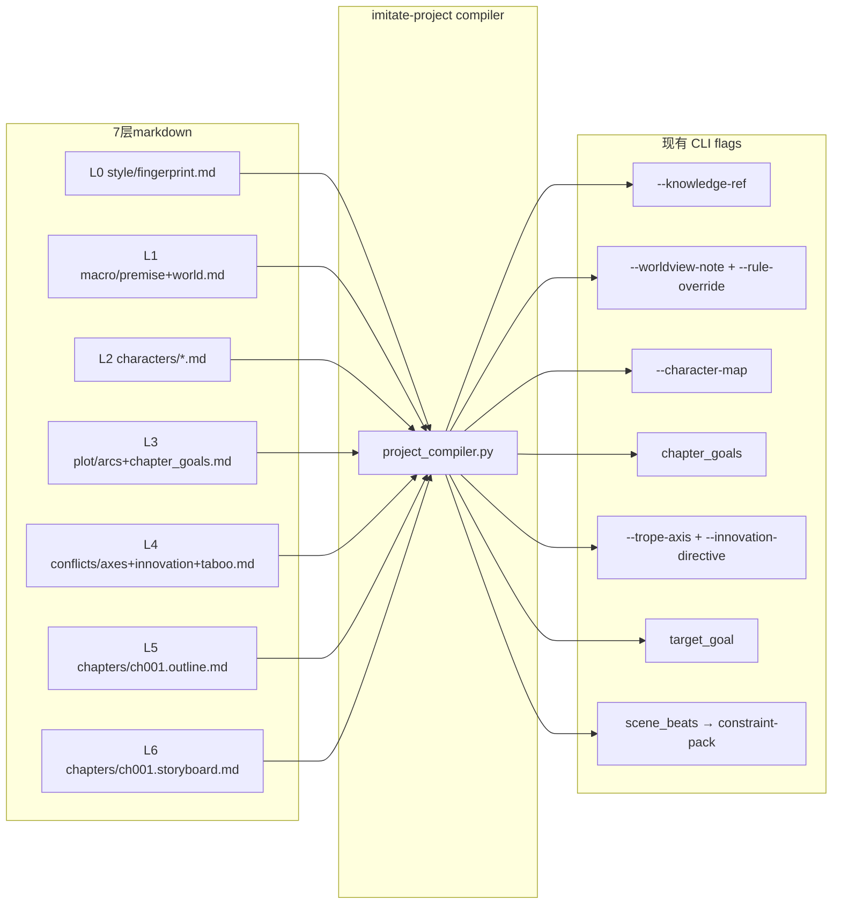

# Phase 6 工作流

## 5 步工作流

1. **auto-run** — 导入范本小说，跑完 Phase 1-5 分析
2. **init** — 初始化项目目录，生成 7 层 markdown 骨架
3. **generate layers** — 逐层生成（fingerprint → macro → characters → plot → conflicts → outline → storyboard）
4. **review / lock** — 作家审阅每层，满意后 lock；lock 后该层不再被覆盖
5. **prose** — 调用 harness-imitation 产出正文，Loom 信号实时反馈

## 7 层 → 编译器 → 现有 CLI flag

## 4 种典型反馈循环

**改大观**（L1）：修改 macro/premise.md → `imitate-project macro <slug> --regen` → 重新 lock → 下游层自动标记 stale

**改主角声音**（L2）：编辑 characters/<name>.md → `imitate-project characters <slug> --regen <name>` → 重新 lock

**改章纲**（L5）：编辑 chapters/ch001.outline.md → `imitate-project outline <slug> ch001` → 重新 lock → storyboard 标记 stale

**改正文**（L7）：直接编辑 draft.md → `imitate-project diff <slug> ch001` 查看 Loom 信号变化

## Gates / Lock / Fast 模式

**lock**：`imitate-project lock <slug> "macro/*.md"` 锁定指定层，后续 run 跳过已锁层。

**gate**：每层生成后自动运行 satire-anti-slop-guard（见 [anti-slop checker](../../../novel_analyzer/services/satire_anti_slop_service.py)）。gate 不通过时生成停止，提示作家修改。

**fast 模式**：`--fast` 跳过所有 gate，直接跑到目标层。适合快速原型，不适合正式写作。

## 关联文档

- [README.md](./README.md) — Phase 6 定位 + 7 层表
- [arch-alignment.md](./arch-alignment.md) — 边界澄清
- [../roadmap.md](../roadmap.md) — Phase 6 任务清单
