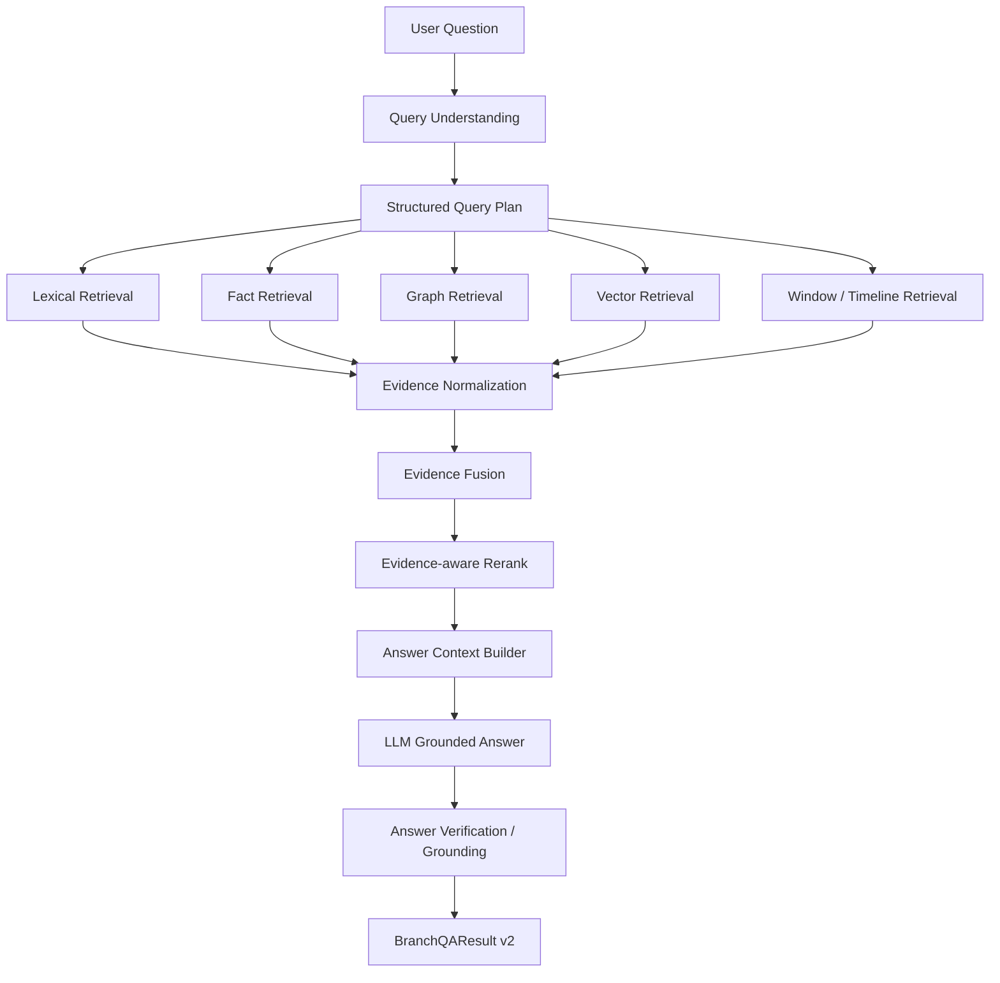

# 02. V2 目标架构设计

## 1. 总体目标

把当前 QA 从：

`question -> search_branch -> prompt -> answer`

升级为：

`question -> query understanding -> retrieval plan -> multi-lane retrieval -> evidence fusion -> graph reasoning -> evidence-aware rerank -> grounded answer generation -> answer verification`

---

## 2. 目标架构图



---

## 3. 核心新层：Structured Query Plan

V2 最重要的新对象不是新的 reranker，而是 `StructuredQueryPlan`。

建议结构：

```json
{
  "question_type": "timeline",
  "intent": "trace_change",
  "entities": ["卫图", "单武举"],
  "aliases": ["那个少年"],
  "relations": ["师徒"],
  "world_rules": [],
  "time_scope": {
    "chapter_start": 1,
    "chapter_end": 20,
    "relative": "before"
  },
  "answer_expectation": "multi_chapter_explanation",
  "retrieval_plan": {
    "prefer_graph": true,
    "prefer_timeline": true,
    "prefer_window": true,
    "need_causal_chain": true,
    "need_foreshadow_threads": false
  }
}
```

### 为什么要它
因为后面的 retrieval / rerank / context builder 都应该基于同一个中间契约，而不是各自猜问题意图。

---

## 4. Query understanding 设计

## 4.1 分层理解，而不是一步到位

### L0：快速规则层
用于低成本识别：
- question type
- chapter range
- spoiler limit
- obvious named entities

### L1：结构化解析层
可先用 prompt/LLM，也可混合规则：
- 主体 entity
- 客体 entity
- 时间范围
- 关系/规则/事件约束
- 期望答案类型（单章事实 / 多章链路 / 因果解释 / 伏笔回收）

### L2：澄清 / ambiguity detect（后续）
识别：
- “他/她/那个少年” 多指代冲突
- “为什么”但没有明确对象
- 时间范围过大

V2 先做 L0+L1 即可。

---

## 5. Retrieval 设计

## 5.1 Retrieval 不再只返回 chapter hit
建议统一抽象成 `EvidenceHit`：

```json
{
  "source_type": "chapter_summary | chunk | fact | graph_path | window | causal_chain",
  "chapter_index": 12,
  "score": 0.82,
  "lane": "graph",
  "label": "卫图 --relates_to--> 单武举",
  "text": "卫图正式成为单武举弟子",
  "evidence": ["..."],
  "metadata": {}
}
```

### 目的
这样 rerank 和 answer builder 才能真正“看证据”，而不是只看 chapter card。

---

## 5.2 五条主召回 lane

### A. Lexical lane
继续保留：
- `fts`
- `similarity`
- `like`
- `keyword`

### B. Fact lane
从 `FactRecord` 直接召回：
- `entity`
- `event`
- `continuity`
- 后续可扩 `relation / conflict / foreshadowing / world_rule`

### C. Graph lane
从图谱显式召回：
- entity node
- neighbor expansion
- relationship chain
- world rule connected subgraph
- foreshadow open/payoff path
- causal chain path

### D. Vector lane
继续保留 chunk embedding 召回，但建议未来：
- query embedding cache
- chunk-level result output
- section-aware chunk prefix

### E. Window / Timeline lane
专门服务这类问题：
- “前20章主线如何推进”
- “A 和 B 的关系怎么变”
- “某个状态从哪章开始变化”

---

## 5.3 Graph retrieval 升级方向

当前 `relationship_route` 太轻，V2 可分三步：

### Step 1: typed graph route
按 node/edge type 分路：
- relation route
- world_rule route
- foreshadow route
- causal route

### Step 2: path retrieval
返回 path，而不是只返回章节分数：
- `卫图 -> participates_in -> 拜师事件 -> advances_to -> 师徒关系`

### Step 3: question-conditioned subgraph
按问题类型裁剪子图，而不是整个 snapshot 平铺注入。

---

## 6. Rerank 设计

## 6.1 从“章节重排”升级为“证据重排”

当前 rerank 文本太粗，V2 应至少支持：
- `chapter_summary`
- `chunk_text`
- `fact label + evidence`
- `graph path text`
- `window summary`

### 建议策略
分两层：
1. lane 内部重排
2. lane 间融合后统一 rerank

---

## 6.2 question-aware rerank
不同问题类型，rerank 输入不同：

| 问题类型 | 更该看的证据 |
|---|---|
| relation | relation node / graph path / conflict |
| world_rule | world_rule node / rule-linked event |
| timeline | window / follows / advances_to / causal |
| foreshadow | foreshadow open/payoff path |
| character | entity + event + continuity |

---

## 7. Answer generation 设计

## 7.1 先构建 answer context contract
建议把回答输入从平铺字符串升级为结构化：

```json
{
  "question": "...",
  "query_plan": {...},
  "top_evidence": [...],
  "chapter_evidence": [...],
  "fact_evidence": [...],
  "graph_paths": [...],
  "window_evidence": [...],
  "causal_evidence": [...],
  "foreshadow_threads": [...]
}
```

### 作用
prompt 模板更稳，后续也更好 debug。

---

## 7.2 回答模式分层

建议 V2 支持至少三种 answer mode：

### Mode A: direct_fact
问题本质是单章或少量章节事实确认。

### Mode B: multi_hop_explanation
问题需要跨章节串联证据。

### Mode C: conservative_insufficient_context
证据不足时明确保守回答。

当前已经有 degraded 和 insufficient_context，但还不够显式。

---

## 7.3 回答后验证

保留并增强：
- claim extraction
- grounding score
- unsupported claim demotion
- confidence calibration

建议 V2 增加：
- per-claim evidence mapping
- answer span → evidence span 对齐率
- graph claim coverage

---

## 8. 结果对象升级建议

建议 `BranchQAResult` 后续增加：

```json
{
  "query_plan": {},
  "top_evidence": [],
  "retrieval_diagnostics": {},
  "graph_paths": [],
  "grounding_summary": {},
  "failure_reason": null
}
```

这样前端、评估、debug 才有稳定 contract。

---

## 9. 技术实现建议：先轻后重

### 第一阶段
- 规则 + prompt 生成 `StructuredQueryPlan`
- 不改底层表结构，先改 service contract
- graph route 先做 typed route

### 第二阶段
- 引入 `EvidenceHit`
- rerank 吃 chunk / fact / graph path
- answer builder 结构化

### 第三阶段
- graph-aware rerank
- question-conditioned subgraph retrieval
- better answer verification

---

## 10. V2 不建议一开始就做的事

- 不建议立刻切 Neo4j
- 不建议先换 embedding 模型
- 不建议先微调 reranker
- 不建议先加非常重的 agentic planner

优先级应该是：
**结构化 query plan > 证据对象统一 > graph retrieval 升级 > rerank 增强 > 模型微调**
